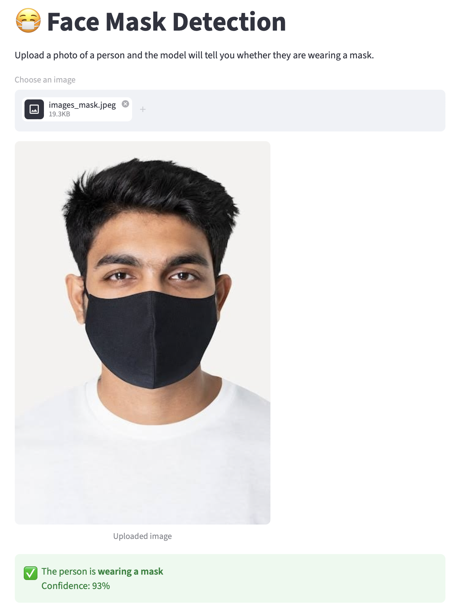

# 😷 Face Mask Detection (CNN)

Classify face photos as **with mask** or **without mask** using a convolutional neural network built and trained from scratch.

**🔗 Live app:** [facemask-detection-app-cnn-01.streamlit.app](https://facemask-detection-app-cnn-01.streamlit.app/)



## Results

| Metric | Value |
|---|---|
| Train accuracy (epoch 5) | 92.3% |
| Validation accuracy (epoch 5) | 90.2% (best: 92.7% at epoch 4) |
| Test accuracy | **89.5%** (on 1,511 unseen images) |
| Test loss | 0.330 |

## Dataset

- **Source:** Kaggle, [Face Mask Dataset](https://www.kaggle.com/datasets/omkargurav/face-mask-dataset) by omkargurav
- **Size:** 7,553 images (3,725 with mask, 3,828 without mask), so the classes are well balanced
- **Target:** 1 = with mask, 0 = without mask

## Approach

1. Downloaded and extracted the dataset with the Kaggle API.
2. Created labels from the two folders (`with_mask`, `without_mask`).
3. Resized all images to 128 × 128, converted them to RGB, and turned them into a NumPy array of shape `(7553, 128, 128, 3)`.
4. Split the data 80% / 20% (6,042 train, 1,511 test). During training, 20% of the training set was held out for validation.
5. Scaled pixel values to the 0–1 range.
6. Built a CNN with Keras (architecture below).
7. Trained with Adam and sparse categorical cross-entropy for 5 epochs.
8. Plotted training and validation loss and accuracy curves.
9. Built a predictive system and tested it on my own photo.
10. Deployed the model as a Streamlit web app.

## Model architecture

| Layer | Details |
|---|---|
| Conv2D | 32 filters, 3 × 3, ReLU, input 128 × 128 × 3 |
| MaxPooling2D | 2 × 2 |
| Conv2D | 64 filters, 3 × 3, ReLU |
| MaxPooling2D | 2 × 2 |
| Flatten | |
| Dense | 128 units, ReLU |
| Dropout | 0.5 |
| Dense | 64 units, ReLU |
| Dropout | 0.5 |
| Dense (output) | 2 units |

The two dropout layers reduce overfitting, which shows in the curves: validation accuracy stays close to training accuracy.

## Tech stack

Python · TensorFlow / Keras · NumPy · Pillow · OpenCV · scikit-learn · Matplotlib · Streamlit · Google Colab

## Project structure

```
facemask-detection-app/
├── app.py                  # Streamlit web app
├── face_mask_model.h5      # trained model
├── requirements.txt        # dependencies
└── README.md
```

## Run locally

```bash
git clone https://github.com/YOUR_USERNAME/facemask-detection-app.git
cd facemask-detection-app
pip install -r requirements.txt
streamlit run app.py
```

## Limitations and next steps

- **Classifier, not a detector.** The model looks at the whole image. It works best on close-up face photos like the training data, and may struggle with group photos or faces far from the camera. Adding a face detection step (for example OpenCV or MediaPipe) before classification would fix this.
- **Output layer.** The output uses sigmoid with a 2-class loss. Softmax is the standard pairing for sparse categorical cross-entropy and would give cleaner probabilities.
- **Early stopping.** Validation accuracy peaked at epoch 4 and dropped at epoch 5. An `EarlyStopping` callback would keep the best model automatically.
- **No data augmentation.** Flips, rotations, zoom and brightness changes would help with real-world photos.
- **Transfer learning.** A pretrained network such as MobileNetV2 would likely push accuracy well above 90% (see my [Dog vs Cat project](https://dog-cat-classifier-02.streamlit.app/), which reaches 98%).
- **Evaluation.** A confusion matrix, precision and recall would show which class the model confuses more often.

## Author

**Arshavir Voskanyan**
